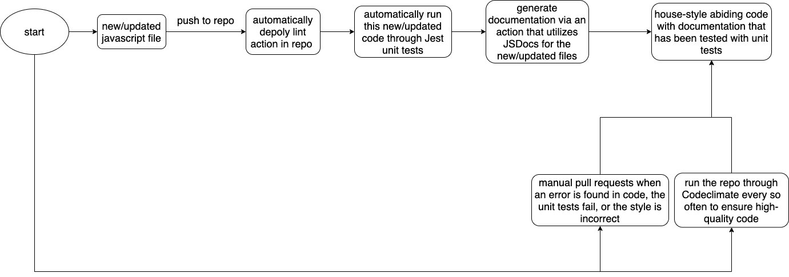

# Phase 1 of the CI/CD pipeline

## Linting and code style enforcement
- There is currently an action built for the collection\_team branch that automatically parses through javascript files and ensures that they are agreeing to the backend house style for javascript that is located in [Backend House Style](/specs/house_styles/backend_house_style.md).
	- This action is called everytime someone pushes to the collection\_team branch.
- There will be probably another action built for html and perhaps css, but that might change.

## Code quality via tool
- We are using Codeclimate to review the code quality using a tool.
	- The link to the Codeclimate page for the repo is: https://codeclimate.com/github/Max-Edelson/cse110-sp21-group16
	- Codeclimate is setup to automatically review the code within each pull request an will raise a flag if is sees something wrong in code quality or complexity.

## Code Quality via human review
- We now have branch protection over the ```main``` branch that requires that two people, other than the poster, reviews and approves the changes before allowing any pull requests through. 

## Unit tests via automation
- Jest has been set up to automatically run through a GitHub action that activates on a push to the ```demo-team``` branch and it checks that ```LocalStorage.js``` operates correctly.

## Documentation generation via automation
- JSdocs is setup in the auto-linting github action to provide automatic documentation generation each time code is loaded onto the ```collection_team``` branch.

## Project checkpoint 1 video
- https://youtu.be/7QSyaevo0jk

## Project checkpoint 1 diagram
- 
