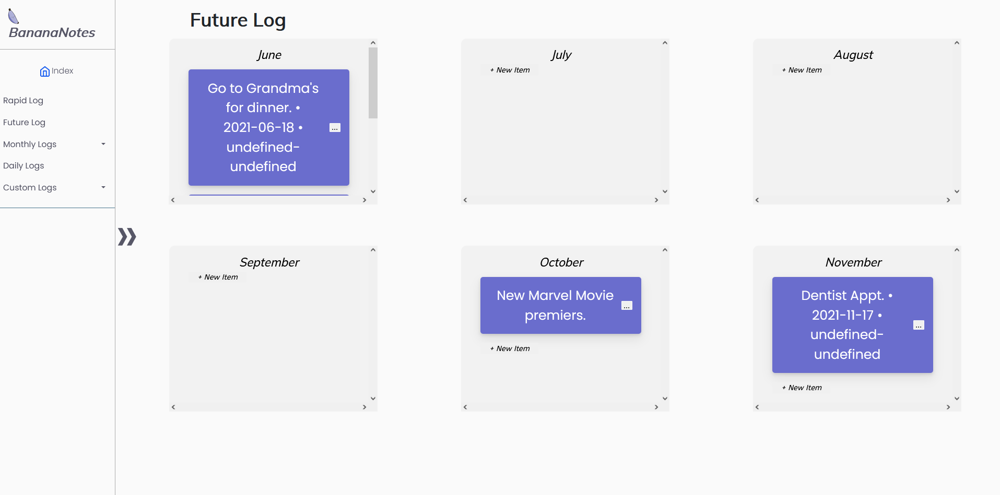

# BananaNotes

BananaNotes is a bullet journaling application that is designed to rapidly log and organize a user's information. The goal of this application is to function as a planner, journal, and task list.

## Usage
Visit [BananaNotes](./index.html) to get started.

### **Rapid Logging Page**
When you first open the app, you will be confronted with our rapid logging page. This is where you will be able to quickly and easily log information about the day, may it be a note, task, or event.

**Rapid logging page**

### **Monthly Log**
The monthly log contains all the notes, tasks, and events for each day in a given month. Clicking on a day will allow the user to insert a new Task, Event, or Note for that specific day. Clicking on an item in a day will open up a window with information for that day.


**Calender view of the monthly log**

### **Daily Log**
The daily log contains all the information for a given day and all information from the rapid log is sent to the daily log if it was inserted in the item-view page. Information is added to the log through migration from the rapid log.

**Daily log**

### **Future Log**
The future log contains a limited amout of notes, tasks, and events (up to eight) for each month up to six months from the current month. Clicking on an item in a list will open up information about the item. Information is added to the log through migration from the rapid log.

**Future log**

### **Custom Log**
The custom log is where the user can make lists that are not necessarily time based. The custom log displays tasks, events, and notes out in a list style. An example of this can be a custom log for favorite books: Ex. Pathfinder, Airborn, Skybreaker, etc...

**List style custom log**

## Usage


## Contributing
Pull requests are welcome. For major changes, please open an issue first to discuss what you would like to change.

## Authors and Constributions
Author information can be found [here](admin/team.md). 

## Support
For any issues with BananaNotes that require the authors' aid, please start a new issue with the label ```support```.

## Gain access to the CodeClimate review of our code at: 
https://codeclimate.com/github/Max-Edelson/cse110-sp21-group16
