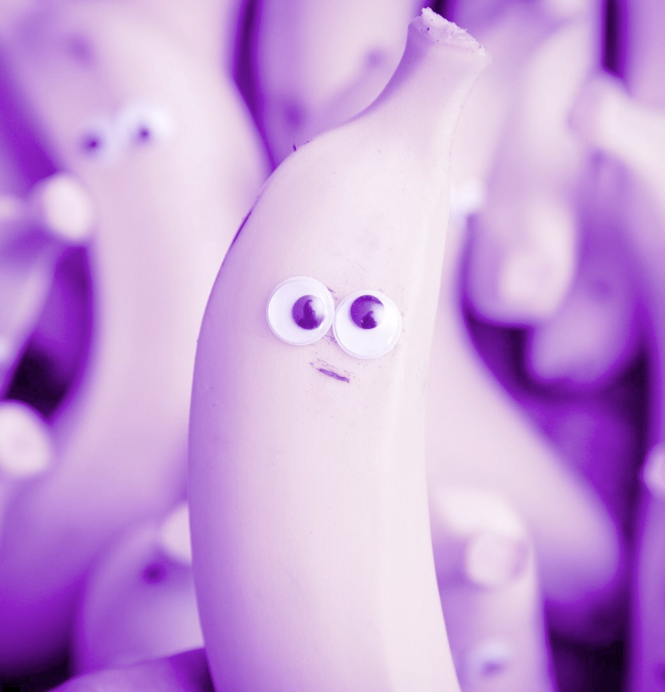

Team name: #import <creative.name>  
Team color: purple  
Emblem: 

Values:
- Honesty
- Perseverence
- Transparency
- Responsability
- Teamwork
- Openmindedness

Maxim Edelson (https://github.com/Max-Edelson): I'm a second year computer science major with a passion for machine learning. I absolutely love food and I'm always cooking up a feast.

Javier Galvan (https://github.com/Ovijavi): I'm third year Math-Computer Science major. I love to play games so hit me up with you wanna get beat in smash bros. 

Carmen Li (https://github.com/carmenli14/): I'm a second year Computer Science major with strong interests in design and software development. In my free time, I love to bake, binge-watch dramas, or just do nothing ^-^

Ricardo Guerrero (https://github.com/InfernalDrago): I'm a second year Computer Science major. My hobbies are playing RPG video games, reading fantasy novels and manga, and watching anime. I want to make games in the future.

Qiuyu Tong (https://github.com/aimeeqiuyu): I am a third year computer science major. I like travelling and taking selfies. 

Sophia Klueter (https://github.com/sophiaklu): I am a second year Math-Computer Science major with a strong interest in frontend design. I love art, drawing, and painting. I also love to travel and experience new cultures and their amazing food.
